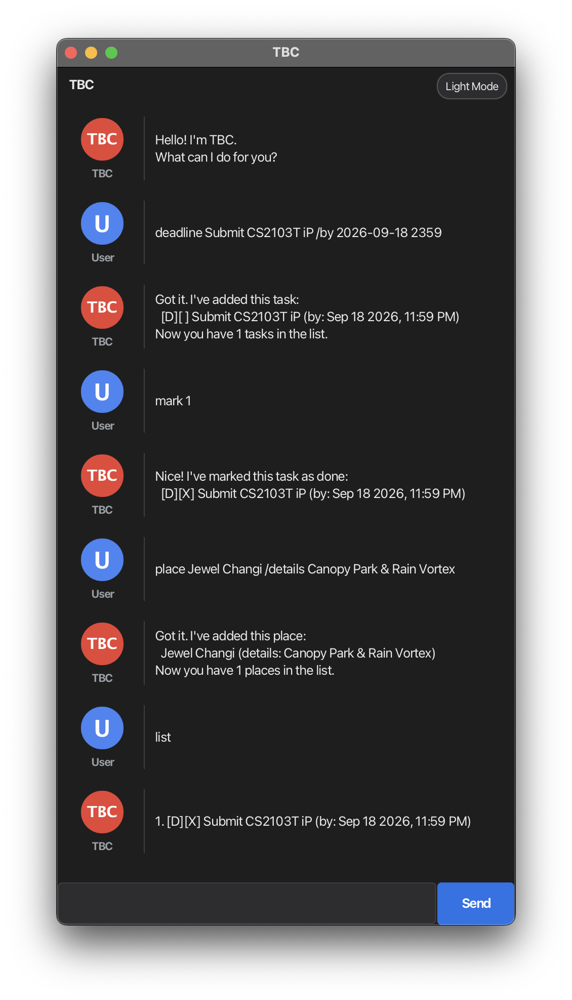

# TBC - User Guide

**TBC** is a desktop personal assistant chatbot optimized for fast keyboard-based task and place management through a Command Line Interface (CLI) paired with a graphical user interface (GUI).



---

## Table of Contents
- [Quick Start](#quick-start)
- [Command Format Conventions](#command-format-conventions)
- [Task Management Features](#task-management-features)
  - [Adding a To-Do: `todo`](#adding-a-to-do-todo)
  - [Adding a Deadline: `deadline`](#adding-a-deadline-deadline)
  - [Adding an Event: `event`](#adding-an-event-event)
  - [Listing All Tasks: `list`](#listing-all-tasks-list)
  - [Marking a Task as Done: `mark`](#marking-a-task-as-done-mark)
  - [Marking a Task as Incomplete: `unmark`](#marking-a-task-as-incomplete-unmark)
  - [Deleting a Task: `delete`](#deleting-a-task-delete)
  - [Searching Tasks by Keyword: `find`](#searching-tasks-by-keyword-find)
  - [Undoing Previous Action: `undo`](#undoing-previous-action-undo)
- [Place Management Features](#place-management-features)
  - [Adding a Place: `place`](#adding-a-place-place)
  - [Listing All Places: `places`](#listing-all-places-places)
  - [Searching Places: `findplace`](#searching-places-findplace)
  - [Deleting a Place: `deleteplace`](#deleting-a-place-deleteplace)
- [General Features](#general-features)
  - [Exiting the Application: `bye`](#exiting-the-application-bye)
  - [Data Persistence](#data-persistence)
- [Command Summary](#command-summary)

---

## Quick Start

1. Ensure that you have **Java 25** installed on your system.
2. Download the latest `duke.jar` from the releases page.
3. Place `duke.jar` into an empty working folder.
4. Open a terminal, navigate to the folder containing the file, and launch the application:
   ```bash
   java -jar duke.jar
   ```
5. Type your command into the text box and press **Enter** (or click **Send**) to execute it.

---

## Command Format Conventions

* Words in `UPPER_CASE` represent parameters supplied by the user.
  * Example: In `todo DESCRIPTION`, `DESCRIPTION` is a parameter such as `read book`.
* Parameters in square brackets `[ ... ]` are optional.
  * Example: `place NAME [/details DETAILS]`
* Date and time arguments can be formatted as:
  * `yyyy-MM-dd` (e.g. `2026-10-15`)
  * `yyyy-MM-dd HHmm` (e.g. `2026-10-15 1800`)
* The pipe character `|` is reserved for data storage and cannot be used in descriptions, details, or keywords.
* Commands and parameters are separated by spaces. Leading and trailing whitespace are automatically trimmed.
* Item indices (`INDEX`) must be positive integers starting from `1` matching the currently displayed list.